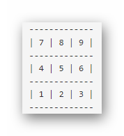
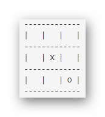

## Игра в крестики-нолики против компьютера на Java через консоль
Cтоит задача не просто реализовать игру Крестики-нолики, а реализовать игру так, чтобы она функционировала по правилам игры и одновременно удовлетворяла всем нижеперечисленным требованиям.
#### Алгоритм игры: 
0. Информируем пользователя что он может ходит через комбинации цифр 1-9 в определнные ячейки.
  
1. Определяем кто первым делает ход: компьютер или пользователь.
2. Пользователь делает ход: ставит крестик в пустую ячейку.
3. Отображаем текущее состояние игрового поля.
4. Если пользователь выиграл, то отобразить сообщение: ВЫ ВЫИГРАЛИ! и перейти к завершающему этапу.
5. Иначе: Если нечья, то отобразить сообщение: Извините, ничья. и перейти к завершающему этапу.
6. Иначе: Компьютер делает ход: ставит нолик в пустую ячейку.
7. Отображается текущее состояние игрового поля.
8. Если компьютер выиграл, то отобразить сообщение: ВЫ ВЫИГРАЛИ! и перейти к завершающему этапу.
9. Иначе: Если нечья, то отобразить сообщение: Извините, ничья. и перейти к завершающему этапу.
10. Иначе: Если никто не выиграл и не ничья, то игра продолжается: перейти к шагу 2. в задании.
11. Завершающий этап: вывести на консоль сообщение ИГРА ЗАВЕРШЕНА!. и завершить выполнение программы.

Подробнее об игре: (https://ru.wikipedia.org/wiki/%D0%9A%D1%80%D0%B5%D1%81%D1%82%D0%B8%D0%BA%D0%B8-%D0%BD%D0%BE%D0%BB%D0%B8%D0%BA%D0%B8)

[Вверх](#anchor)
